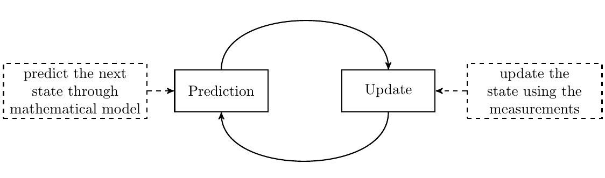

# Kalman Filter for 2-wheeled mobile robots

### Robotic systems course project - 2022/2023

The Kalman filter is a predictive filter based on the model of the behaviour of a system. The aim of predictive filters is to reduce the measurement error on the basis of the knowledge of the system model.

In order to accomplish this goal, the filter firstly performs an estimate of the state variable of the system and compares it with sensor data. The resulting error is then cyclically reduced through a PI controller in which the proportional constant (*Kp*) is updated at each iteration.  

Eventually, the output of the controller is used to correct the prediction.

Our project consists in designing a Kalman filter for our two-wheeled robots, in order to make values from the optical encoders more reliable.

------

 

- for documentation, check [docs/](docs/)
- code for Kalman filter **simulation** in [simulation/](simulation/)

- library code for **optimized Kalman filter** in [optimized](optimized/)

- for case study data and plots check [case_study/](case_study/)

------

### Authors

Marco Pometti - DIEEI

Giovanni Campo - DMI

Andrea Galofaro - DIEEI
