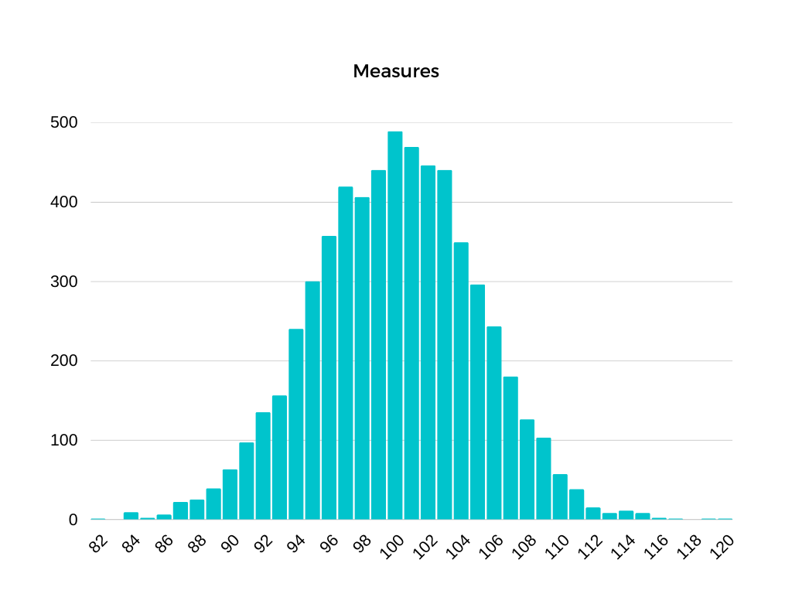
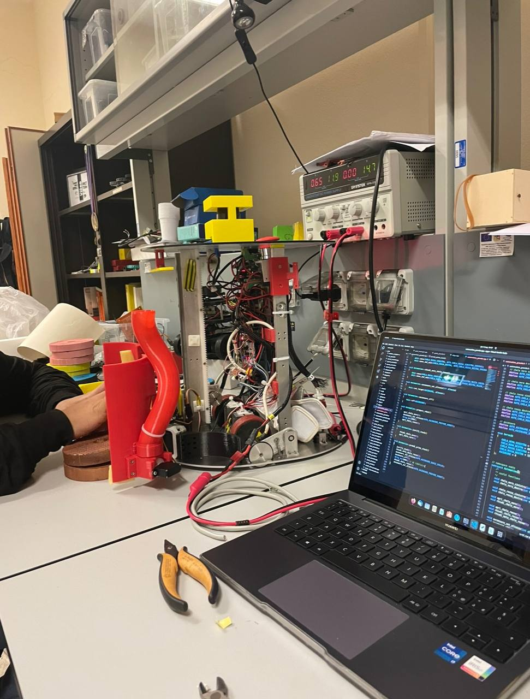
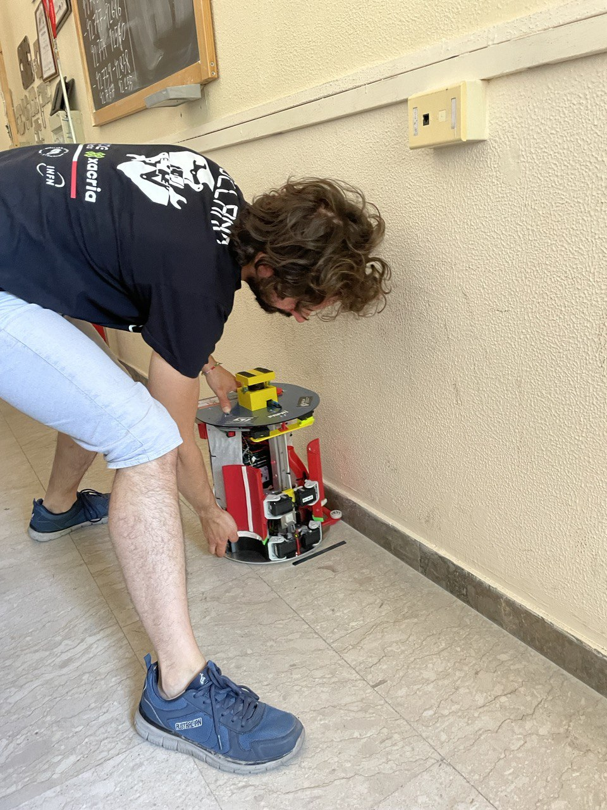
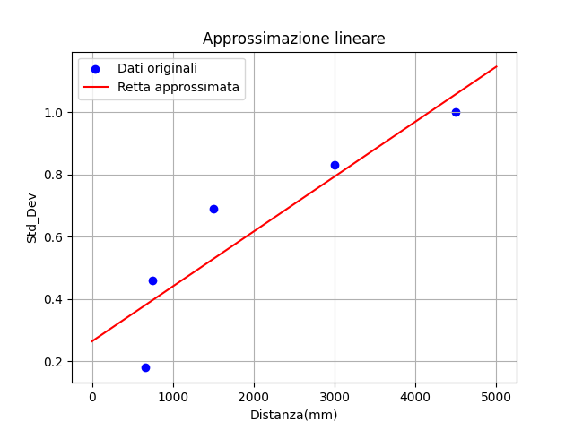
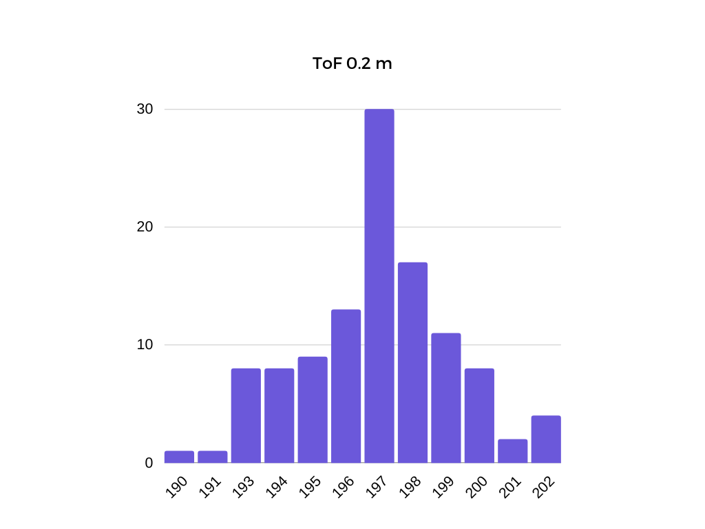
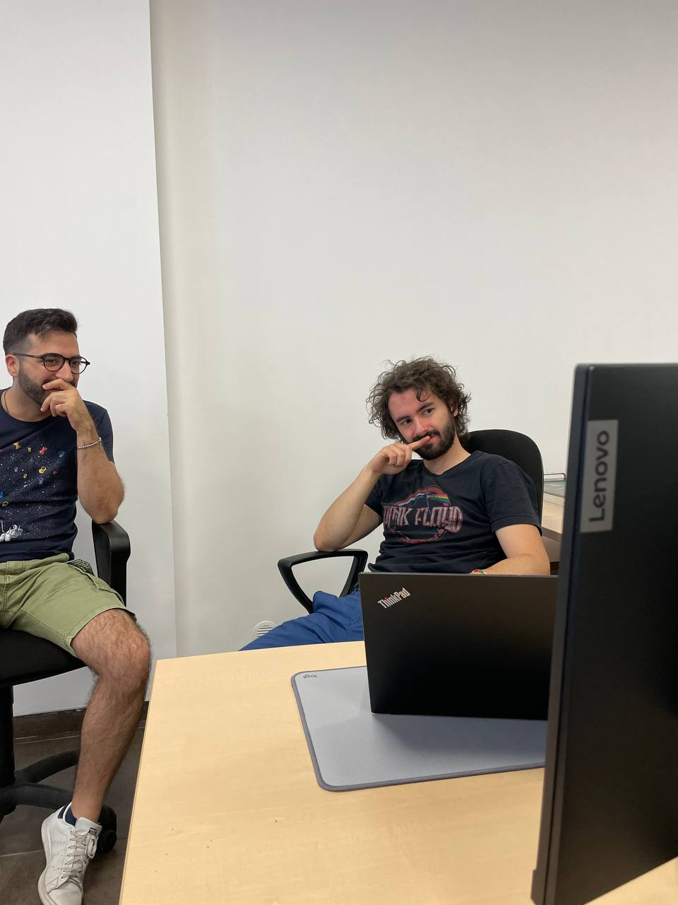

# Kalman Filter for 2-wheeled mobile robots

### Robotic systems course project - 2022/2023


## Introduction

The Kalman filter is a predictive filter based on the model of the behaviour of a system. The aim of predictive filters is to reduce the measurement error on the basis of the knowledge of the system model.

In order to accomplish this goal, the filter firstly performs an estimate of the state variable of the system and compares it with sensor data. The resulting error is then cyclically reduced through a PI controller in which the proportional constant (*Kp*) is updated at each iteration.  

Eventually, the output of the controller is used to correct the prediction.


Our project consists in designing a Kalman filter for our two-wheeled robots, in order to make values from the optical encoders more reliable.

 


## Software

The Kalman Filter needs some matrices in order to work:

- X is the state vector; it contains the state variables of the model:

$$
X = \begin{bmatrix}
x_R \\
y_R \\
\theta_R
\end{bmatrix}
$$

- Q is the covariance matrix of the uncertainty of the system; in its main diagonal, there are the variance values for each state variable:

$$
Q = \begin{bmatrix}
\sigma_{x_R}^2 & 0 & 0 \\
0 & \sigma_{y_R}^2 & 0 \\
0 & 0 & \sigma_{\theta_R}^2
\end{bmatrix}
$$

- R is the covariance matrix of the uncertainty of the measure; in its main diagonal, there are the variance values for each state variable:

$$
R = \begin{bmatrix}
\sigma_{x_E}^2 & 0 & 0 \\
0 & \sigma_{y_E}^2 & 0 \\
0 & 0 & \sigma_{\theta_E}^2
\end{bmatrix}
$$

- H is the matrix that specifies the state variables measured (in this case the y component):

$$
H = \begin{bmatrix}
0 & 0 & 0 \\
0 & 1 & 0 \\
0 & 0 & 0
\end{bmatrix}
$$

- P is the covariance error matrix;
- K is the optimal gain (the proportional constant).


------


The complete algorithm is shown as follows:

- ***Prediction***

During the prediction step, we initialized the state matrix A and the state vector x̂ using the mathematical models of a two-wheeled robot.
$$
x̂ = A x̂
$$

- ***Update of error covariance***

The error covariance matrix P is determined from the covariance matrix Q.
$$
P = A P A^T + Q
$$

- ***Optimal gain***

Then K is computed such that P is minimal.
$$
K = P H^T (H P H^T + R)^{-1}
$$

- ***Measure correction***

Starting from the updated K and the prediction given by the model, we correct the measure starting from another sensor.
$$
x̂ = x̂ + K (z − H x̂)
$$

- ***Error covariance correction***

$$
P = (I − K H) P
$$


The algorithm is iteratively repeated for all the duration of the sampling.


------


### Matrix.cpp

Since there is no numpy in C++, we decided to implement our own library for handling the matrix operations involved within the Kalman algorithm.


#### Constructor

It is possible to make matrices and vectors of any dimension by just indicating the number of rows, the number of columns and the elements within an array.

```c++
Matrix (unsigned int _num_rows, unsigned int _num_cols, double _matrix[])
            : num_cols{_num_cols}, num_rows{_num_rows}
        {
            matrix = new double*[num_rows];
            for(unsigned short i=0; i<num_rows; i++){
                matrix[i] = new double[num_cols];
                for(unsigned short j=0; j<num_cols; j++)
                {
                    matrix[i][j] = _matrix[j + num_cols*i];
                }
            }
        }
```


#### Transpose

`transpose()` returns a matrix with inverted rows and cols.

```c++
Matrix transpose ()
        {
            double* temp_matrix = new double[num_rows*num_cols];
            unsigned int index = 0;
            for(unsigned short i=0; i<num_rows; i++)
            {
                for(unsigned short j=0; j<num_cols; j++)
                {
                    temp_matrix[index] = this->matrix[j][i];
                    index++;
                }
            }
            return Matrix(num_cols,num_rows,temp_matrix);
        }
```


#### Invert

`invert()` returns an inverted matrix using the Laplace development algorithm.

```c++
Matrix invert ()
{
    // STEP 0 -> check if the matrix is squared
    if(this->num_cols != this->num_rows){
        printf("[Matrix] la matrice non è quadrata, quindi non è invertibile\n");
        return Matrix(0);
    }

    // STEP 1 -> check if the matrix determinant is null
    double det;
    this->determinante(&det);
    if(det == 0){
        printf("[Matrix] il determinante è nullo, quindi non è invertibile\n");
        return Matrix(0);
    }

    // STEP 2 -> if it is not null, the matrix is invertible
    double inverted_matrix[this->num_cols * this->num_rows];
    unsigned int index = 0;

    for(unsigned short i=0; i<num_rows; i++)
    {
        for(unsigned short j=0; j<num_cols; j++)
        {
            inverted_matrix[index] = this->cofattore(i,j);
            index++;
        }
    }

    Matrix M(this->num_cols,this->num_rows,inverted_matrix);
    M = M.transpose();
    return M * (1/det);
}
```


Apart from these, there have been implemented:

- overloading of * operator for matrix product and value-wise product;
- `determinant` method for computing the determinant of square matrices of any order;
- `cofactor` method used recursively with the determinant method;


------


### KalmanOdometry.cpp

The algorithm shown above is implemented within this file in the class `KalmanOdometry` through these methods:

- `prediction()` gathers the first three steps of the algorithm.

It takes two parameters in input: the distance traveled by the left wheel (Δp_left) and the one traveled by the right wheel (Δp_right).


------


#### Prediction

We use these values for calculating the kinematic model of the system (odometry):

***Average of the distance traveled by the wheels (delta_l)***
$$
∆p = \frac{∆p_{left} + ∆p_{right}}{2}
$$
***Relative rotation of the robot (delta_th)***
$$
∆θ = \frac{∆p_{right} − ∆p_{left}}{B}
$$
*where B is the value of the wheelbase.*

***State variables***
$$
x_R = x_R + ∆p \cos{\theta_R} + \frac{∆\theta}{2}
$$

$$
y_R = y_R + ∆p \sin{\theta_R} + \frac{∆\theta}{2}
$$

$$
\theta_R = \theta_R + ∆\theta
$$

This is how it is written in the code:

```c++
double delta_l = (delta_left + delta_right) / 2.0;
double delta_th = (delta_right - delta_left) / this->wheelbase;

double delta_x = delta_l * cos(this->th_r + delta_th / 2.0);
double delta_y = delta_l * sin(this->th_r + delta_th / 2.0);

this->x_r = this->x_r + delta_x;
this->y_r = this->y_r + delta_y;
this->th_r = this->th_r + delta_th;
```


Since Kalman filter is designed to work only with linear systems, we have to linearize ours too; we use the Jacobian, the matrix of all first-order partial derivatives of our state variables:

***before Jacobian***
$$
A = \begin{bmatrix}
x_R & 0 & ∆p\cos{\theta_r+\frac{∆\theta_R}{2}} \\
0 & y_R & ∆p\sin{\theta_r+\frac{∆\theta_R}{2}} \\
0 & 0 & \theta_R + ∆\theta
\end{bmatrix}
$$
***after Jacobian***
$$
A = \begin{bmatrix}
\frac{\partial f_1}{\partial x_R} & \frac{\partial f_1}{\partial y_R} & \frac{\partial f_1}{\partial \theta_R} \\
\frac{\partial f_2}{\partial x_R} & \frac{\partial f_2}{\partial y_R} & \frac{\partial f_2}{\partial \theta_R} \\
\frac{\partial f_3}{\partial x_R} & \frac{\partial f_3}{\partial y_R} & \frac{\partial f_3}{\partial \theta_R}
\end{bmatrix} = \begin{bmatrix}
1 & 0 & -∆p\sin{\theta_r+\frac{∆\theta_R}{2}} \\
0 & 1 & ∆p\cos{\theta_r+\frac{∆\theta_R}{2}} \\
0 & 0 & 1
\end{bmatrix}
$$
Here is how it is written in code:

```c++
∆pdouble _a[] = {1.0, 0.0, -delta_y,
               0.0, 1.0, delta_x,
               0.0, 0.0, 1};
_A->set(3,3,_a);
```


Then, we define the state vector (X):

```c++
double _x[] = {this->x_r, this->y_r, this->th_r};
        // già trasposta
        X->set(3,1,_x);
```


and update the covariance error matrix and the gain:

```c++
// update of the covariance error matrix
(*P) = (*A) * (*P) * (A->transpose()) + (*Q);

// update of the optimal gain
(*S) = (*H) * (*P) * (H->transpose()) + (*R);
(*K) = ((*P) * (H->transpose())) * (S->invert());
```


------

- `measure()` takes a matrix with the collected measure from an hypothetic ToF sensor (Time of Flight) .


#### Measure

Here is the step where we correct the measurement error:

```c++
(*X) = (*X) + (*K) * ((*Measure) - (*H) * (*X));
this->x_r = X->getMatrix()[0][0];
this->y_r = X->getMatrix()[1][0];
this->th_r = X->getMatrix()[2][0];
```


------

- `update()`updates the value of the covariance error matrix.


#### Update

```c++
(*P) = ((*Identity) - (*K) * (*H)) * (*P);
```


------


### Results of the simulation

We conducted a first simulation of the filter using random Gaussian variables generated by a C++ standard library object as the output of the ToF sensor.

We put the variables iteratively within the algorithm and the primary results were quite encouraging:

```c++
// from main.cpp
while(t < 150000)
{
    double delta_l = 79.6;
    double delta_r = 79.6005;

    if(t > 500)
    {
        delta_l = 0;
        delta_r = 0;
    }

    ko->prediction(delta_l, delta_r, ko->x_r, ko->y_r, ko->th_r);

    double _measure = 100.0 + std::round(d(gen));
    ++hist_measure[_measure];
    // printf("[Main] Normal random: %f\n", _measure);

    _measures[1] = _measure;

    // già trasposta
    Measures->set(3,1,_measures);

    ko->measure(Measures);
    ko->update();

    ++hist_prediction[ko->y_r];

    printf("[Main] x %f, y %f\n", ko->x_r, ko->y_r);
    t = t + delta_t;
    i++;
}
```

We simulate the movement of the wheels of the robot for the first 5 seconds; then it stops.

`prediction()`, `measure()` and `update()` are called in the while loop simulating a sampling from the encoders lasting 15 seconds.

In `_measure` the value from the ToF sensor is constantly updated with a random Gaussian value given by `std::round(d(gen))`.


##### This is the histogram of the measures collected during the simulation (for the y component):



It is clear how they describe the behaviour of a normal distribution.


##### And then the histogram of the predicted values (for the y component):


The filter was able to reduce the noise coming from the ToF sensors!


## Case study


#### Next step of our project consisted in implementing the filter in real two wheeled robot built within ARSLAB, a laboratory of University of Catania.




First step of our work involved us in collecting ticks from the encoders of the robot, in order to calculate the variance of error of measurement for each distance:

#### Samples of data collected during distance measurement 

| 660 mm  | 750 mm  | 1500 mm  | 3000 mm  | 4500 mm  |
| ------- | ------- | -------- | -------- | -------- |
| 660.938 | 751.443 | 1499.165 | 2998.653 | 4499.371 |
| 661.262 | 751.605 | 1498.873 | 2999.300 | 4501.409 |
| 660.906 | 751.216 | 1499.165 | 2999.494 | 4499.500 |
| 661.165 | 751.540 | 1499.229 | 3000.497 | 4502.153 |
| 660.647 | 751.184 | 1499.391 | 3000.012 | 4499.209 |
| 661.068 | 751.605 | 1499.521 | 3000.594 | 4501.797 |
| 660.809 | 751.378 | 1499.682 | 3000.174 | 4499.597 |
| 661.230 | 751.572 | 1499.391 | 3000.497 | 4501.506 |
| 660.744 | 751.281 | 1499.715 | 3000.206 | 4498.885 |

It is clearly visible how variance from a measure from another increases as much as the distance does.




For calculating the variance for each measurement we used this equation:
$$
\sigma^2 = \frac{\sum{(x_i - x)^2}}{N}
$$
These are the values of variance resulted from the data:

| 660 mm | 750 mm | 1500 mm | 3000 mm | 4500 mm |
| ------ | ------ | ------- | ------- | ------- |
| 0,031  | 0,213  | 0,473   | 0,688   | 1,002   |


Our first thought was to use these variances directly on Q matrix (process covariance matrix), but then a problem raised. The variances were related to total distance, whilst we needed a variance value per millimeter. For doing that, we calculated by means of the minimum squared algorithm a straight line that could include by approximation all the standard deviations per millimeter.



The following equation describes the behaviour of the straight line:
$$
y = 0.0002x + 0.26
$$
Therefore, the Q matrix will be updated as the following matrix in which the alpha factor is the angular coefficient of the equation above:
$$
Q = \begin{bmatrix}
(∆p\cdot\alpha)^2 & 0 & 0 \\
0 & (∆p\cdot\alpha)^2 & 0 \\
0 & 0 & (∆p\cdot\alpha)^2 \\
\end{bmatrix}
$$
Following this concept, as many ticks are collected in a sampling, as much the error related to the system increases.


For determining the variance of the real ToF sensor of the robot, we made a similar collection of data and calculated as follows:

| ToF 200 mm |
| :--------: |
|    200     |
|    196     |
|    197     |
|    199     |
|    197     |
|    191     |
|    194     |
|    193     |
|    196     |

with a variance value of 5,389, that we used for updating the matrix R (covariance of measure error matrix).




#### The second step of the work consisted in implementing the Kalman filter within the firmware of the real robot.

Starting from the telemetry files of the firmware we re-implemented telemetry in motion control section of the robot in order to collect in real-time data from ToF sensor:

```c++

// This CAN frame handles data from new ToF sensors (VL53L1X)
if ((rxmsg.cm_hdr.ch_id & 0xfff0) == DISTANCE_SENSOR_NEW_CAN_MASK_ID) {
    //int sensor_id = rxmsg.cm_hdr.ch_id & 0xf;
    const t_can_distance_sensor_new_data * d = (const t_can_distance_sensor_new_data 		 *)rxmsg.cm_data;
    distance_collection->new_distance_data(d->sensor, d->distance);
if (d->sensor == 4) {
    // printf("[DistanceSensor] CANid=%x, id=%d, distance = %d, alarm=%d\n", 				rxmsg.cm_hdr.ch_id, d->sensor, d->distance, d->alarm);
    newId4Data = true;
    }
	return;
}
```

In this way, we were able to recognize when sensor 4 collected a new value of distance and we made it communicate with odometry flow:

##### Odometry

```c++
float _f_delta_tick_L = delta_tick_L * m_wheel_factor_left;
float _f_delta_tick_R = delta_tick_R * m_wheel_factor_right;

if( mc_can_task->newId4Data && isMinorThan200) {
    printf("[KalmanOdometry] Doing prediction...\n");
    ko->prediction(_f_delta_tick_L, _f_delta_tick_R, robot_pose.x, robot_pose.y, 			robot_pose.theta);
}

// ...

// CON KALMAN
if( mc_can_task->newId4Data && isMinorThan200) {
    printf("[KalmanOdometry] Acquiring distance from sensor 4...\n");
    double _measures[3] = {0.0, 0.0, 0.0};
    int _measure = mc_can_task->get_distance_by_id(4);
    // adjusting measure
    _measure = 15.56550834 + 0.8194841248 * _measure;
    _measures[1] = _measure;
    // già trasposta
    this->Measures->set(3,1,_measures);
    ko->measure(Measures);
}

// ...

// CON KALMAN
else {
    robot_pose.x = ko->x_r;
    robot_pose.y = ko->y_r;
    new_theta = ko->th_r;
    printf("[KalmanOdometry] Updating...\n");
    printf("[KalmanOdometry] x: %f, y: %f, th: %f\n", robot_pose.x, robot_pose.y, 			new_theta);
    ko->update();
    mc_can_task->newId4Data = false;
}
```

Then, we decided to make the filter working only under certain distance thresholds and only when a new value had been acquired.


### Conclusions



Our poor engineers were thinking about their decisions in life in the moment the photo was taken, but after all the project made all of us thinking how make things in the real world needs a large amount of effort and it is always important to do as much as it is possible.

To sum up, the simulation of the Kalman filter was utterly successful but the implementation within the robot required us a little more of effort than expected.

Good luck to everyone wants to join our same adventure and praise for a 30L!
